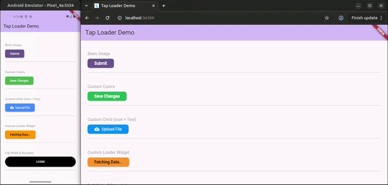

# tap_loader

A production-ready Flutter package providing a customizable button that automatically shows a loading indicator while an asynchronous task is running.

[](https://pub.dev/packages/tap_loader)
[](https://opensource.org/licenses/MIT)

## Features

- **Automatic Loading State**: Handles async operations and shows a loader automatically.
- **Micro-Animations**: Smooth transitions between button content and the loader.
- **Highly Customizable**: Customize colors, text styles, border radius, loader type, and more.
- **Double-Tap Prevention**: Automatically disables the button while loading to prevent multiple triggers.
- **Platform Optimized**: Works seamlessly on Android, iOS, Web, and Desktop.

## Demo

<p align="center">
  
</p>


## Getting Started

Add `tap_loader` to your `pubspec.yaml`:

```yaml
dependencies:
  tap_loader: <latest_version>
```

Then run:

```bash
flutter pub get
```

## Usage

### Simple Usage
The simplest way to use `tap_loader` is by providing a `text` and an `onTap` callback.

```dart
TapLoaderButton(
  text: "Login",
  onTap: () async {
    // Perform async task like login API call
    await Future.delayed(Duration(seconds: 2));
  },
)
```

### Custom Child
You can also provide a custom widget as the button's content.

```dart
TapLoaderButton(
  onTap: () async {
    await Future.delayed(Duration(seconds: 2));
  },
  child: Row(
    mainAxisSize: MainAxisSize.min,
    children: [
      Icon(Icons.login),
      SizedBox(width: 8),
      Text("Login"),
    ],
  ),
)
```

### Full Customization

```dart
TapLoaderButton(
  text: "Submit",
  buttonColor: Colors.deepPurple,
  textColor: Colors.white,
  loaderColor: Colors.white,
  borderRadius: 12.0,
  elevation: 5.0,
  height: 55.0,
  width: 200.0,
  onTap: () async {
    await Future.delayed(Duration(seconds: 3));
  },
  loaderWidget: CircularProgressIndicator(
    color: Colors.white,
    strokeWidth: 2,
  ),
)
```

## Parameters

| Parameter | Type | Default | Description |
|-----------|------|---------|-------------|
| `onTap` | `Future<void> Function()?` | `null` | Callback triggered when tapped. Button loads during execution. |
| `text` | `String?` | `null` | Text to display (required if `child` is null). |
| `child` | `Widget?` | `null` | Custom widget for button content. |
| `buttonColor` | `Color?` | `Theme.primaryColor` | Background color of the button. |
| `loaderColor` | `Color?` | `Colors.white/black` | Color of the default activity indicator. |
| `textColor` | `Color?` | `Colors.white/black` | Color of the text (ignored if `child` is used). |
| `borderRadius` | `double` | `8.0` | Radius of the button corners. |
| `elevation` | `double` | `2.0` | Shadow elevation. |
| `height` | `double?` | `null` | Button height. |
| `width` | `double?` | `null` | Button width. |
| `loaderWidget`| `Widget?` | `CupertinoActivityIndicator` | Custom loader widget. |
| `disabledColor`| `Color?`| `Theme.disabledColor`| Color when disabled or loading. |

## License

This project is licensed under the MIT License - see the [LICENSE](LICENSE) file for details.
